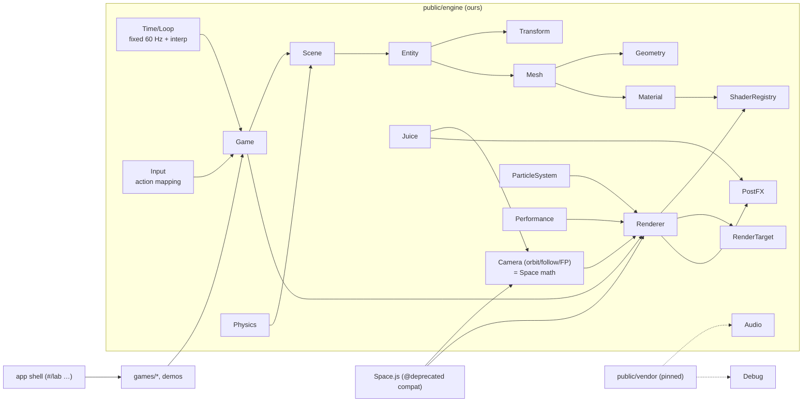
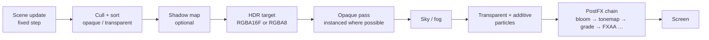
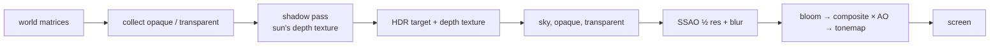

# Architecture

> Status: **P1 (core engine) done; light system, models and animation added (§8).** §1 is the P0 audit; §7 describes the engine as built in P1.
> Sections marked *Target* are plans, not code. They get updated phase by phase.

## 1. What exists today (audited P0)

### 1.1 Files

| Path | Role | Notes |
|---|---|---|
| `public/Space.js` | The renderer (WebGL1) | Orbit camera, hand-built view basis, dot-product projection, flat vec4 geometry arrays, incremental upload. Cleaned in P0. |
| `public/Main.js` + `public/index.html` | **Prime Walk 3D** demo | A walk that turns at primes; one cube per integer, baked face shading, orbit/pan/zoom, auto-framing. |
| `public/preview.html` | **OBJ viewer** | Self-contained OBJ/MTL parser, baked shading, orbit/pan/zoom; drives `Space` directly. |
| `public/runner.html` | Redirect to Neon Rush | The game moved to its own repo. |
| `public/Shapes/Structure.js` | Geometry slice (vec4 arrays + AABB) | Used by Prime Walk via `addStructure`. |
| `public/Shapes/Path.js`, `Face.js`, `public/Point.js` | Linked-list path from the original Canvas-2D prototype | **No longer imported by anything** after P0 (Space used to build a throw-away `Face` on startup). |
| `index.js` | Express static dev server (`npm start`, port 9600) | Kept. |
| `.github/workflows/pages.yml` | Deploys `public/` to GitHub Pages on push to `main` | Kept. |
| `public/cup verts.txt` (10.7 MB), `public/teamugstl-converted-ASCII.stl` (19.7 MB), `public/solid Exported from Blender-2.80 (s.txt` (19.7 MB) | Model data | **Not referenced by any page.** The two STL files are byte-identical. All three are deployed to Pages (~50 MB). See §5, decision D1. |
| `public/.idea/`, `public/.vscode/`, `public/note.txat` | Editor settings / a to-do note | Deployed publicly by Pages. See D1. |

### 1.2 Corrections to the brief's "current state"

The upgrade brief (§1) was written against an older snapshot. Verified reality:

| Brief says | Actual (before P0) |
|---|---|
| Keyboard listeners hard-coded in the engine | Only `=`/`-` (magnify) remained in `Space`; moved to Prime Walk in P0. |
| `moveStructure` re-uploads the full buffer | Still true (marks the buffer dirty). Appends already upload only the new tail. |
| No DPR/resize handling | Engine: true. Prime Walk and the OBJ viewer handle DPR/resize themselves. |
| No game loop / delta time | Engine: true. Prime Walk has its own `requestAnimationFrame` loop with `dt`. |
| No lighting | Engine: true. Prime Walk and the OBJ viewer **bake** per-face shading into vertex colours. |
| `alert()` on link failure, no compile logs | True; fixed in P0 (throws with the compiler log). |
| Dead Canvas-2D code | True; removed in P0. |

### 1.3 The `Space` API and who depends on it

`Space` is used by three consumers:

| Member | Prime Walk | OBJ viewer | Neon Rush (`RunnerSpace extends Space`) |
|---|---|---|---|
| `X0 Y0 Z0 Rc alpha beta Xc Yc Zc` | ✓ | ✓ | ✓ |
| `xUnitVec yUnitVec zUnitVec`, `updateMyVectors()` | ✓ | ✓ | ✓ |
| `magnifier`, `far` | ✓ | ✓ | ✓ |
| `addStructure` / `addElements` | `addStructure` | writes `posArr`/`colArr`/`totalVert` directly | `addElements` |
| `clearScene`, `reDraw` | ✓ | `reDraw` | ✓ (inside its own FBO pass) |
| `program posId colId cPointLoc x/y/zAxisLoc varsLocation vPointLoc` | – | – | ✓ swaps in its own program |

**Neon Rush vendors its own copy of `Space.js`** (repo `rohitpatil9121/neon-rush`). Nothing in this
repo can break it at runtime. It is still the reference for the compatibility layer: every member in the
table above must keep working (see §3.4).

### 1.4 The core math (kept, and documented rather than replaced)

```
camera position          Xc = X0 + cos(β)·cos(α)·Rc
                         Yc = Y0 + cos(β)·sin(α)·Rc
                         Zc = Z0 + sin(β)·Rc

view direction (zAxis)   normalize(target − camera)
screen-up (yAxis)        world-up (0,0,1) projected onto the plane ⟂ zAxis
                         (the "lamdanot" construction in getYaxisUnitVector)
screen-left (xAxis)      zAxis × yAxis   (the shader negates it → screen-right)

projection (vertex)      v = p − camera
                         x = −dot(v, xAxis) · f / aspect
                         y =  dot(v, yAxis) · f
                         w =  dot(v, zAxis)            ← divide by depth via w (clips behind camera)
                         f = 1.25 · magnifier
```

Verified numerically in P0: the three axes are orthonormal for arbitrary `α`, `β`, `Rc` and targets
(except exactly straight up/down, `β = ±π/2`, where "up" is undefined; callers clamp `β`).

### 1.5 Bugs found during the audit

| # | Bug | Status |
|---|---|---|
| B1 | Prime Walk: when the page loads in a hidden tab, the canvas is 0×0 → `aspect = 0` → `frameTarget` returns `Infinity` → camera distance eases to `NaN` forever (**black screen**). Also plausible on mobile rotation. | **Fixed in P0** (guard + finite check). |
| B2 | Engine logged `col id is : 1` and the `Face` constructor logged on every page load. | **Fixed in P0.** |
| B3 | Link/compile failure used `alert()` with no details. | **Fixed in P0** (throws `Error` with stage + compiler log). |
| B4 | `vPoint`/`coord` uniforms set every frame but never read by the shader. | **Fixed in P0** (removed; `vPointLoc` kept as `null` for Neon Rush's subclass). |

## 2. Target architecture *(Target)*

### 2.1 Principles
1. **Our core stays ours.** Camera (orbit on a sphere, hand-built basis, Z-up, dot-product projection)
   becomes a documented `Camera` class; `Space` becomes a thin compatibility wrapper around it.
2. **No build step.** Plain ES modules; libraries via an import map with pinned versions **and** vendored
   copies in `public/vendor/` (see §4).
3. **Libraries behind our own modules** (`Audio` wraps ZzFX, `Debug` wraps Tweakpane…).
4. **Every visual feature is backed by a reusable system** (glow → PostFX, sparks → ParticleSystem, …).
5. **No fake data.** Anything unfinished is labelled "Planned — see ROADMAP" or not shown.

### 2.2 Module map (created only when a phase needs it)



### 2.3 Rendering pipeline



WebGL2 is the target, with WebGL1 as a fallback where it's reasonable. Instancing, VAOs, float render
targets and multiple render targets are WebGL2 features, so the WebGL1 fallback gets reduced effects
(no HDR bloom chain, CPU-batched instead of instanced). A readable failure screen is shown when neither is available.

### 2.4 Compatibility layer *(Target, P1)*
`Space` keeps its public surface (table in §1.3) and delegates to `Camera` + `Renderer`. Tests in
`tests/compat.html` exercise: `addStructure`, `addElements`, `clearScene`, `reDraw`, `moveStructure`,
the camera fields, `magnifier`/`far`, and subclassing with a swapped program (the Neon Rush pattern).

## 3. Decisions

| ID | Question | Decision |
|---|---|---|
| D1 | Delete the ~50 MB of unreferenced model data and the editor folders from `public/`? | **Done (P1).** Deleted `cup verts.txt`, both identical ASCII STLs, `.idea/`, `.vscode/`, `note.txat`. The mug is kept as `assets/models/teamug.stl` (binary, 59,330 triangles, 2.97 MB). `public/` went from ~53 MB to ~3 MB. |
| D2 | GSAP uses a custom "Standard no-charge" license, not on the allowed list. | **Accepted.** No GSAP in this repo; our own `Tween` (P4) + CSS / Web Animations API. Neon Rush keeps it for now. |
| D3 | Fonts are SIL OFL 1.1. | **Accepted.** OFL allowed for fonts only, self-hosted in `public/vendor/fonts/` (P3). |
| D4 | twgl.js | **Skipped.** Our own small wrappers (`gl/ShaderProgram`, `Geometry`, `Mesh`). |
| D5 | Lighthouse "Performance ≥ 85" with a live WebGL hero | Planned: hero starts after first paint; no artificial loading delay. |
| D6 | Import map vs relative vendored paths | **Relative vendored paths through one file (`engine/vendor.js`).** Pages live at different depths (`/`, `/examples/`, `/experiments/x/`), so a single import map would need a different base per page. The pinned version is part of the path; upgrading is a one-line change. |

## 4. Dependency strategy

- Import map in every HTML entry, pinned exact versions, pointing at **`./vendor/…`** (local copies).
  The CDN URL is recorded in `THIRD_PARTY.md` for provenance and updates, but not used at runtime,
  so the site works offline and can't break if a CDN changes.
- Each vendored file keeps its original license header; the full license text sits next to it.

```html
<script type="importmap">
{ "imports": {
    "gl-matrix":     "./vendor/gl-matrix@3.4.4/esm/index.js",
    "zzfx":          "./vendor/zzfx@1.3.2/ZzFX.js",
    "tweakpane":     "./vendor/tweakpane@4.0.5/tweakpane.min.js",
    "simplex-noise": "./vendor/simplex-noise@4.0.3/simplex-noise.js"
} }
</script>
```

## 5. Phase plan

| Phase | Deliverable |
|---|---|
| P0 | Audit, cleanup, this document, THIRD_PARTY.md ✔ |
| P1 | Core engine: WebGL2 renderer, `Camera`, loop, `Input` (action mapping), scene graph, mesh/geometry, instancing, `Space` compat + tests |
| P2 | Materials, lights, `ShaderRegistry`, fog/sky, palette, `PostFX` + bloom |
| P3 | App shell: loading, hero, "Enter the lab", routing, command palette, perf HUD, quality |
| P4 | `ParticleSystem`, `Juice`, `Tween`, `Audio` |
| P5 | Game registry + immersive player (Neon Rush external, Prime Walk) |
| P6 | Shader Lab + gallery (8 shaders) |
| P7 | 3D Playground, physics experiments, 8 demos |
| P8 | Prime Walk upgrade (100k+ instanced cubes) + starter template game |
| P9 | Performance, mobile, accessibility, error-handling pass |
| P10 | Docs, examples, easter eggs, v1.0.0 |

## 6. Risks

| Risk | Mitigation |
|---|---|
| Scope: P1–P10 is a large amount of work; quality could thin out | Finish each phase fully before the next; anything not finished goes to ROADMAP.md, never shown as done. |
| WebGL1 fallback doubles shader work | Keep the fallback to "renders correctly, fewer effects"; no feature parity promise. |
| Performance targets on mid-range Android | Quality tiers + auto-downgrade from P3; measured, not assumed. The actual device test must be done by you (I can only emulate). |
| Lighthouse/a11y scores are measured in a real browser run | I'll run Lighthouse via the browser where possible and report the real numbers, pass or fail. |
| Breaking Neon Rush's pattern | It vendors its own engine copy; the compat tests cover its subclassing pattern anyway. |

## 7. The engine as built (P1)

### 7.1 Modules

| Module | Responsibility |
|---|---|
| `engine/config.js` | All engine constants: attribute slots, quality presets, loop timing, camera limits, default lighting. |
| `engine/vendor.js` | The only import of third-party code (gl-matrix 3.4.4, vendored). |
| `engine/gl/GLContext.js` | WebGL2 first, WebGL1 fallback; patches VAO + instancing extensions onto WebGL1 under WebGL2 names; readable failure panel. |
| `engine/gl/ShaderProgram.js` | Compile/link with `#define` variants, fixed attribute locations, cached uniform setters (per context), `ShaderError` with stage + parsed line numbers. |
| `engine/Camera.js` | The projection_library camera: orbit (yaw/pitch/distance = alpha/beta/Rc), follow (damping + look-ahead), first-person, shake offset. Basis from the original lambda construction. CPU `project()` / `screenRay()` for picking and labels. |
| `shaders/chunks/projection.js` | `projectLab()`: the dot-product projection every vertex shader uses. |
| `engine/Geometry.js`, `engine/geometry/primitives.js` | Typed-array vertex data, lazily uploaded per context. Box, sphere, plane, cylinder, cone, torus, capsule, grid, lines. |
| `engine/Material.js`, `shaders/basic/` | `BasicMaterial`: unlit or Lambert (hemisphere + sun), colour, opacity, emissive, vertex colours. |
| `engine/Mesh.js` | `Mesh` (one VAO per context) and `InstancedMesh` (per-instance mat4 + colour, dirty-range `bufferSubData`). |
| `engine/Transform.js`, `Entity.js`, `Scene.js` | Position / quaternion / scale hierarchy; render-time interpolation between fixed steps; behaviours; deferred destroy. |
| `engine/Loop.js` | Fixed 60 Hz simulation, interpolated render, timeScale, pause, auto-pause when hidden, stall clamping. |
| `engine/Input.js` | Action and axis mapping over keyboard, mouse, touch (drag, pinch), wheel, pointer lock, gamepad. One-report-per-step edge semantics. Binds nothing by default. |
| `engine/Renderer.js` | ResizeObserver + DPR cap per quality, program variant cache, opaque batching by program, transparent back-to-front, per-frame uniforms once per program, stats. |
| `engine/Game.js` | Facade: `new Game({ canvas })`, `add()`, `onUpdate()`, `onRender()`, `start()`. Shows the failure panel instead of throwing when WebGL is missing. |

### 7.2 Key decisions
- **GLSL ES 1.00 everywhere (P1).** Both WebGL1 and WebGL2 accept it, so there's one shader source per material. P2 introduces GLSL 3.00 only where WebGL2-only features (HDR float targets) need it.
- **Fixed attribute slots** (`config.ATTRIB`) are bound before linking, so a VAO built once works with every program variant.
- **Program variants by `#define`** (`LIT`, `VERTEX_COLORS`, `INSTANCED`), cached per renderer; meshes cache their program and rebuild only when `material.invalidateProgram()` bumps its version.
- **No per-frame allocation in the render path.** Lists, uniform arrays and comparators are reused.

### 7.3 Measured (P1, this machine, 1600×900, WebGL2)
| Case | Result |
|---|---|
| 100,000 instanced cubes, static | 1 draw call, 1.2 M triangles, **≈13.9 ms/frame GPU-synced** (≈60–70 fps) |
| 200,000 instanced cubes, static | 1 draw call, 2.4 M triangles, ≈24.4 ms/frame |
| 100,000 cubes re-transformed on the CPU every frame | ≈32 ms/frame. **Too slow for 60 fps.** Animating that many objects belongs on the GPU (vertex-shader animation, P2/P4); CPU updates are for hundreds to a few thousand instances. |

Mid-range Android numbers need a real device.

### 7.4 Tests
`public/tests/index.html` runs 26 browser tests, all passing:
- **Camera:** orthonormal basis, **identical to the original Space maths over 100 random orbits**, project/ray round trip, clipping, follow look-ahead.
- **Scene graph:** transform hierarchy and interpolation, scene update/destroy.
- **Loop:** determinism, timeScale/pause, stall clamp.
- **Input:** action edges, axes, form-field guard.
- **Shaders:** log parsing, `ShaderError`, uniform cache.
- **Renderer:** lit mesh and 100k instancing on **both WebGL2 and the WebGL1 fallback**, transparent ordering.
- **Space compatibility:** the full old API, plus the Neon Rush subclass-with-custom-program pattern.

### 7.5 Known limits (tracked for later phases)
- Normals use the model matrix directly; non-uniform scale needs the inverse-transpose (Light system, P2).
- Virtual joystick for mobile is deferred to P9 (mobile pass); touch drag and pinch work now.
- Prime Walk still runs on `Space`; it moves to the engine (instanced, 100k+) in P8. *(Done in §9: `prime-walk.html`.)*

## 8. Light system, textures, models and animation

Added while building NIGHT MARKET, which needed a lit street with shadows and animated people. Everything
here is optional: a scene that sets none of it renders exactly as before.

### 8.1 Modules

| Module | Responsibility |
|---|---|
| `shaders/chunks/lighting.js` | GLSL chunk: hemisphere ambient, sun with shadow lookup (3×3 PCF), up to 16 point lights, fog. `labLight()`, `labShadow()`, `labPoints()`, `labFog()`. Any ShaderMaterial can include it. |
| `engine/Material.js` → `StandardMaterial` | The fully lit surface: texture, vertex colours, colour palette, specular, rim, alpha test. Variants for instancing and skinning. |
| `engine/ShadowMap.js` | Orthographic depth pass from the sun into a depth texture; the Renderer runs it before the main pass. Optionally keeps the depth of `staticShadow` entities between frames (`cache: true`, WebGL2). |
| `engine/Texture.js` | Images, canvases, ImageBitmaps or raw bytes; uploaded lazily per context. |
| `engine/Animation.js` | `Skeleton`, `AnimationClip`, `Animator` (sampling, cross-fades, joint matrices). Joints are typed arrays, not Entities. |
| `engine/Mesh.js` → `SkinnedMesh` | A mesh bent by an Animator. `mesh.uniforms` lets meshes share a material and differ per mesh. |
| `engine/loaders/GLTF.js` | `.glb` / `.gltf`: meshes, materials, textures, node tree, one skin, animations. |
| `engine/PostFX.js` | Optional screen-space ambient occlusion from a depth texture (`settings.ao`). |
| `engine/Geometry.js` | `joints` / `weights` attributes; `Geometry.merge()` joins many placed parts into one mesh. |

### 8.2 Frame



### 8.3 Key decisions
- **The projection stays ours.** The main pass still uses `projectLab()`. Only the shadow pass uses a
  matrix (the sun has no perspective, so there is nothing of the dot-product projection to preserve there).
- **Lights are uniform arrays, not a deferred pass.** 16 point lights evaluated per fragment is cheap at
  this scale and keeps one forward pass. `Scene.pointLights` is a plain array; the Renderer packs it once
  per frame and sets it on every program that declares the uniforms.
- **Shadows need no opt-in per material.** A program that includes the lighting chunk always has a shadow
  sampler; with no ShadowMap the Renderer binds a 1×1 white texture and strength 0.
- **Self-illumination rides in vertex alpha** (1 = ordinary, 2 = fully self-lit), so signs and lanterns can
  be merged into the same static mesh as the walls around them.
- **Palettes instead of materials per character.** A vertex stores an index; the colour table is a per-mesh
  uniform. A crowd is one program and one material.
- **Skeletons are data.** A character is an Animator (a pose buffer) plus shared clips, so 70 characters
  cost 70 small typed arrays and 70 draw calls, with no scene-graph nodes for bones.
- **GLSL ES 1.00 still, everywhere.** Depth textures and derivatives-free SSAO keep one shader source for
  WebGL2 and the WebGL1 fallback. Without a depth-texture extension, shadows and SSAO switch themselves off.

### 8.4 Tests
`public/tests/lighting.test.js` adds 7 browser tests (40 in total, all passing): `Geometry.merge`, Animator
maths and cross-fades, parsing a hand-built `.glb` (colours, material, skin reordering, animation), a floor
that goes dark under a slab and lights up again with shadows off (and the same with the slab's shadow kept
by the static cache, then moved), a point light alone, and a skinned mesh with shadows and SSAO on both
WebGL2 and the WebGL1 fallback.

### 8.5 Known limits
Four of these were closed in §9 and are struck through here so the history stays readable.
- One skin per glTF file; no compression extensions. ~~No morph targets or sparse accessors.~~
- ~~32 joints per skeleton.~~ Skeletons over 32 joints now go through a float texture (§9.4).
- One shadow-casting light (the sun). ~~One shadow map, no cascades.~~
- The static shadow cache is off by default. It was built to save redrawing NIGHT MARKET's street from the
  sun every frame, and measuring showed it doesn't: on an Intel UHD the street's 150,000 triangles cost about
  0.5 ms in the depth pass, while copying the kept depth into a 2048² map cost about 0.9 ms (a framebuffer
  blit was far worse, around 9 ms). It should pay off only where the static casters are much heavier.
- ~~SSAO is not depth-aware when it blurs, so thin objects get a faint halo.~~
- ~~Instanced meshes still shade with the model matrix.~~ Non-instanced meshes use the inverse-transpose normal
  matrix, which closes the limit noted in §7.5; instanced ones now do the equivalent per axis (§9.3).

## 9. Scale, materials, and the site

Added to take the engine from "a lit street" to "a world you can walk across", and to make what exists
visible: until now the site's front page was Prime Walk on the first renderer, and nothing linked to the
engine's examples.

### 9.1 Modules

| Module | What it adds |
|---|---|
| `engine/Renderer.js` | Frustum culling by bounding sphere; `Entity.lod`; casters collected before culling |
| `engine/ShadowMap.js` | `cascades: 1..3`: boxes fitted to slices of the camera's view, in one atlas; casters culled per box |
| `engine/Material.js` | `PBRMaterial`; normal and emissive maps on `StandardMaterial` |
| `shaders/chunks/lighting.js` | Cascade selection in `labShadow`; `labLightPBR` (GGX, two-tone environment) |
| `engine/Geometry.js` | `computeTangents()`, `applyMorph()`, bounds that follow `markDirty()` |
| `engine/Mesh.js`, `engine/Animation.js` | Skinning matrices through a float texture for skeletons over 32 joints |
| `engine/Collision.js` | Rays against spheres, boxes, planes, triangles; overlaps; `slideCircle`; `Scene.raycast` |
| `engine/TouchControls.js` | On-screen joystick and buttons feeding Input axes and actions |
| `engine/DebugOverlay.js` | Frame time, draw calls, culled count, triangles, quality switch |
| `engine/PostFX.js` | Depth-aware occlusion blur; Reinhard tone mapping; saturation and contrast |
| `engine/loaders/GLTF.js` | Sparse accessors, tangents, morph targets, metallic / roughness with `{ pbr: true }` |

### 9.2 Culling and levels of detail

- **A sphere, tested in camera space.** The camera already has its three axes, so the test is three dot
  products per mesh and a comparison against the slopes of the side planes. No frustum planes are extracted
  from a matrix, because there is no matrix.
- **Only meshes with trustworthy bounds are culled.** Instanced, skinned and dynamic meshes, and anything
  drawn by a `ShaderMaterial`, are always drawn unless the entity carries a `cullRadius`. Drawing something
  unnecessary is a cost; not drawing something visible is a bug.
- **Shadow casters are collected before culling.** A tree behind the camera still shadows the path ahead.
  Each shadow box then culls casters against its own sides (not its ends: a caster above the box still casts
  into it).
- **LOD swaps the entity's mesh.** `entity.lod` is a list of distances; the Renderer writes `entity.mesh`.
  A `null` level means "not drawn", which is how distant chunks disappear into the fog.

Counted on `examples/open-world.html` (155 meshes, 2,300 trees in 144 chunks, 1600×900, camera in the
clearing): with culling and LOD the main pass is 55 draw calls and 33,000 triangles; with both off it is 155
draw calls and 231,000 triangles. The shadow pass draws 141 casters across three cascades instead of the
432 it would without per-box culling. Frame times are not quoted: `gl.finish()` did not give stable
numbers on this machine (Intel UHD, ANGLE/D3D11), and a count is a fact where a timing would be a guess.

### 9.3 Cascaded shadows

- **One atlas, tiles side by side.** GLSL ES 1.00 has no texture arrays, and one texture keeps the WebGL1
  fallback on the same shader. The fragment picks its tile from its depth along the camera's forward axis.
- **Boxes are fitted to spheres.** The smallest sphere around a slice of the frustum has the same radius
  whichever way the camera faces, so the box never changes size and shadow edges don't swim as you turn.
- **Centres snap to texels.** The box moves in whole-texel steps in the sun's own axes, so edges don't crawl
  as you walk.
- **The same bias in world units for every cascade.** Far cascades are deeper boxes; the normalized depth
  bias is scaled down to match, and the normal offset grows with the texel size.
- **The static cache is for the fixed box only.** A cascade's box follows the camera, so a kept copy would be
  stale on every frame the camera moves.
- **Instanced normals.** For a matrix that rotates and scales without shear, the inverse-transpose is each
  axis divided by its squared length. The instanced vertex shader does that, so stretched instances shade
  correctly without inverting a matrix per vertex.

### 9.4 Materials and skinning

- **PBR shares the Standard shader** behind a `PBR` define, so palettes, vertex colours, instancing, skinning
  and alpha test all work with it and there is still one program per variant.
- **The environment is two colours.** Reflections use the scene's sky and ground colours, blurred toward
  each other by roughness, weighted by Karis's analytic environment-BRDF fit. No cube maps: nothing to
  download, and it matches the ambient the scene already has. `envIntensity` is the artistic control.
- **No gamma-correct pipeline.** Colours are used as given and tone-mapped at the end, as before. Introducing
  linear-light shading would change the look of every existing game.
- **Tangents are a vertex attribute**, computed from UVs when a normal map is first used. Screen-space
  derivatives would have needed an extension on WebGL1.
- **glTF models keep the Standard look by default.** `{ pbr: true }` opts in to metallic and roughness, so
  existing games that load models are unchanged.
- **Joint textures only when needed.** Up to 32 joints the matrices are still a uniform array (no texture
  upload, works everywhere). Above that, one RGBA32F row of four texels per joint, uploaded once per pose
  even though the shadow pass and the main pass both read it.

### 9.5 The site

- `index.html` is a landing page whose hero is the engine running (`site/hero.js`: Renderer, Scene, Camera
  and Loop used directly, so the page keeps its wheel and vertical swipes). Prime Walk moved to
  `prime-walk.html` on the engine (250,000 instanced cubes, one draw call); the original is kept as
  `prime-walk-classic.html`.
- `examples/` has a gallery and one self-contained HTML file per example.
- `docs/` has a hand-written guide and `api.html`, generated from the JSDoc in the source by
  `tools/build-docs.mjs`.
- Thumbnails and the link-preview image are captured from the pages themselves by `tools/shots.mjs`.
- Fonts are self-hosted (Space Grotesk, JetBrains Mono; OFL, decision D3).

### 9.6 Tools and CI

- `tools/chrome.mjs` drives headless Chrome over the DevTools protocol with Node's built-in WebSocket: no
  Puppeteer or Playwright. `npm test` runs the browser test page with software WebGL, so it works on a CI
  machine with no GPU.
- The Pages workflow runs the tests first and deploys only if they pass; it also builds the single-file
  bundle (`tools/build.mjs`, esbuild, the one build-time dependency) and the API reference.

### 9.7 Tests

`public/tests/world.test.js` adds 17 browser tests (57 in total, all passing on WebGL2 and the WebGL1
fallback, on a GPU and on the software renderer): culling and its opt-outs, shadows from off-screen casters,
bounds after `markDirty()`, LOD, cascades (shadow at 0 and at 70 units, box size steady under rotation,
switching back to a fixed box), normal maps and generated tangents, PBR on both contexts, instanced normals
under non-uniform scale, Reinhard and saturation, a 40-joint skeleton through the joint texture, glTF sparse
accessors, morph targets and PBR materials, every Collision function, `Scene.raycast`, TouchControls driving
Input, and the DebugOverlay.

### 9.8 Known limits

- One shadow-casting light (the sun). Point lights do not cast shadows; there are no spot lights.
- Cascades are not blended at their boundaries; a change in sharpness can be seen on large flat ground.
- PBR reflections are the two-tone environment only: no cube maps, no screen-space reflections.
- Morph targets are blended on the CPU and are per geometry, not per instance; morph weight animation in
  glTF is not read.
- Draco and meshopt compression are not supported; one skin per glTF file.
- Collision is tests and one sliding helper, not a physics engine.
- No depth of field.
