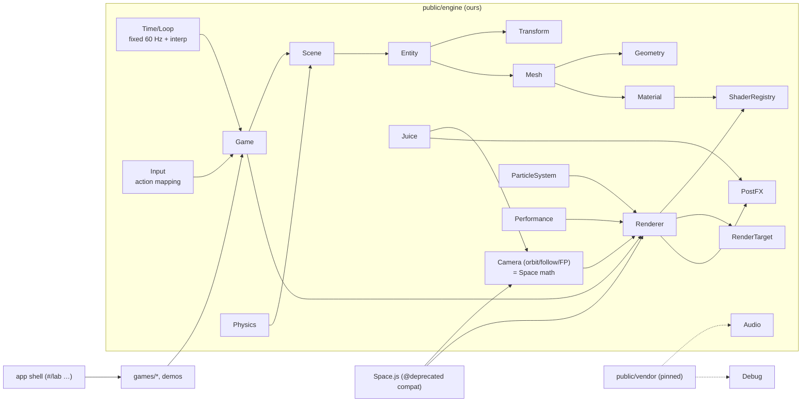
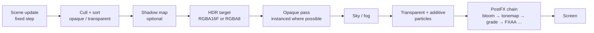

# Architecture

> Status: **P0 (audit)**. This file describes what exists today and the target architecture for
> PROJECTION LAB. Sections marked *Target* are plans, not code. They get updated phase by phase.

## 1. What exists today (audited P0)

### 1.1 Files

| Path | Role | Notes |
|---|---|---|
| `public/Space.js` | The renderer (WebGL1) | Orbit camera, hand-built view basis, dot-product projection, flat vec4 geometry arrays, incremental upload. Cleaned in P0. |
| `public/Main.js` + `public/index.html` | **Prime Walk 3D** demo | A walk that turns at primes; one cube per integer, baked face shading, orbit/pan/zoom, auto-framing. |
| `public/preview.html` | **OBJ viewer** | Self-contained OBJ/MTL parser, baked shading, orbit/pan/zoom; drives `Space` directly. |
| `public/runner.html` | Redirect to Neon Rush | The game moved to its own repo. |
| `public/Shapes/Structure.js` | Geometry slice (vec4 arrays + AABB) | Used by Prime Walk via `addStructure`. |
| `public/Shapes/Path.js`, `Face.js`, `public/Point.js` | Linked-list path from the original Canvas-2D prototype | **No longer imported by anything** after P0 (Space used to build a throw-away `Face` on startup). |
| `index.js` | Express static dev server (`npm start`, port 9600) | Kept. |
| `.github/workflows/pages.yml` | Deploys `public/` to GitHub Pages on push to `main` | Kept. |
| `public/cup verts.txt` (10.7 MB), `public/teamugstl-converted-ASCII.stl` (19.7 MB), `public/solid Exported from Blender-2.80 (s.txt` (19.7 MB) | Model data | **Not referenced by any page.** The two STL files are byte-identical. All three are deployed to Pages (~50 MB). See §5, decision D1. |
| `public/.idea/`, `public/.vscode/`, `public/note.txat` | Editor settings / a to-do note | Deployed publicly by Pages. See D1. |

### 1.2 Corrections to the brief's "current state"

The upgrade brief (§1) was written against an older snapshot. Verified reality:

| Brief says | Actual (before P0) |
|---|---|
| Keyboard listeners hard-coded in the engine | Only `=`/`-` (magnify) remained in `Space`; moved to Prime Walk in P0. |
| `moveStructure` re-uploads the full buffer | Still true (marks the buffer dirty). Appends already upload only the new tail. |
| No DPR/resize handling | Engine: true. Prime Walk and the OBJ viewer handle DPR/resize themselves. |
| No game loop / delta time | Engine: true. Prime Walk has its own `requestAnimationFrame` loop with `dt`. |
| No lighting | Engine: true. Prime Walk and the OBJ viewer **bake** per-face shading into vertex colours. |
| `alert()` on link failure, no compile logs | True; fixed in P0 (throws with the compiler log). |
| Dead Canvas-2D code | True; removed in P0. |

### 1.3 The `Space` API and who depends on it

`Space` is used by three consumers:

| Member | Prime Walk | OBJ viewer | Neon Rush (`RunnerSpace extends Space`) |
|---|---|---|---|
| `X0 Y0 Z0 Rc alpha beta Xc Yc Zc` | ✓ | ✓ | ✓ |
| `xUnitVec yUnitVec zUnitVec`, `updateMyVectors()` | ✓ | ✓ | ✓ |
| `magnifier`, `far` | ✓ | ✓ | ✓ |
| `addStructure` / `addElements` | `addStructure` | writes `posArr`/`colArr`/`totalVert` directly | `addElements` |
| `clearScene`, `reDraw` | ✓ | `reDraw` | ✓ (inside its own FBO pass) |
| `program posId colId cPointLoc x/y/zAxisLoc varsLocation vPointLoc` | – | – | ✓ swaps in its own program |

**Neon Rush vendors its own copy of `Space.js`** (repo `rohitpatil9121/neon-rush`). Nothing in this
repo can break it at runtime. It is still the reference for the compatibility layer: every member in the
table above must keep working (see §3.4).

### 1.4 The core math (kept, and documented rather than replaced)

```
camera position          Xc = X0 + cos(β)·cos(α)·Rc
                         Yc = Y0 + cos(β)·sin(α)·Rc
                         Zc = Z0 + sin(β)·Rc

view direction (zAxis)   normalize(target − camera)
screen-up (yAxis)        world-up (0,0,1) projected onto the plane ⟂ zAxis
                         (the "lamdanot" construction in getYaxisUnitVector)
screen-left (xAxis)      zAxis × yAxis   (the shader negates it → screen-right)

projection (vertex)      v = p − camera
                         x = −dot(v, xAxis) · f / aspect
                         y =  dot(v, yAxis) · f
                         w =  dot(v, zAxis)            ← divide by depth via w (clips behind camera)
                         f = 1.25 · magnifier
```

Verified numerically in P0: the three axes are orthonormal for arbitrary `α`, `β`, `Rc` and targets
(except exactly straight up/down, `β = ±π/2`, where "up" is undefined; callers clamp `β`).

### 1.5 Bugs found during the audit

| # | Bug | Status |
|---|---|---|
| B1 | Prime Walk: when the page loads in a hidden tab, the canvas is 0×0 → `aspect = 0` → `frameTarget` returns `Infinity` → camera distance eases to `NaN` forever (**black screen**). Also plausible on mobile rotation. | **Fixed in P0** (guard + finite check). |
| B2 | Engine logged `col id is : 1` and the `Face` constructor logged on every page load. | **Fixed in P0.** |
| B3 | Link/compile failure used `alert()` with no details. | **Fixed in P0** (throws `Error` with stage + compiler log). |
| B4 | `vPoint`/`coord` uniforms set every frame but never read by the shader. | **Fixed in P0** (removed; `vPointLoc` kept as `null` for Neon Rush's subclass). |

## 2. Target architecture *(Target)*

### 2.1 Principles
1. **Our core stays ours.** Camera (orbit on a sphere, hand-built basis, Z-up, dot-product projection)
   becomes a documented `Camera` class; `Space` becomes a thin compatibility wrapper around it.
2. **No build step.** Plain ES modules; libraries via an import map with pinned versions **and** vendored
   copies in `public/vendor/` (see §4).
3. **Libraries behind our own modules** (`Audio` wraps ZzFX, `Debug` wraps Tweakpane…).
4. **Every visual feature is backed by a reusable system** (glow → PostFX, sparks → ParticleSystem, …).
5. **No fake data.** Anything unfinished is labelled "Planned — see ROADMAP" or not shown.

### 2.2 Module map (created only when a phase needs it)



### 2.3 Rendering pipeline



WebGL2 is the target, with WebGL1 as a fallback where it's reasonable. Instancing, VAOs, float render
targets and multiple render targets are WebGL2 features, so the WebGL1 fallback gets reduced effects
(no HDR bloom chain, CPU-batched instead of instanced). A readable failure screen is shown when neither is available.

### 2.4 Compatibility layer *(Target, P1)*
`Space` keeps its public surface (table in §1.3) and delegates to `Camera` + `Renderer`. Tests in
`tests/compat.html` exercise: `addStructure`, `addElements`, `clearScene`, `reDraw`, `moveStructure`,
the camera fields, `magnifier`/`far`, and subclassing with a swapped program (the Neon Rush pattern).

## 3. Decisions that need the owner *(open)*

| ID | Question | Recommendation |
|---|---|---|
| D1 | Delete the ~50 MB of unreferenced model data and the editor folders from `public/`? | Delete `cup verts.txt`, the duplicate STL, `.idea/`, `.vscode/`, `note.txat`. Move **one** STL to `public/assets/models/` (as a real test asset for the P7 STL loader), converted to binary STL (~10× smaller). |
| D2 | GSAP (used by Neon Rush's UI) uses a custom "Standard no-charge" license, not one on the allowed list. | For **this** repo, animate the UI with our own `Tween` (P4) plus CSS/Web Animations API. Neon Rush can be migrated to `Tween` later (separate repo, only if you want). |
| D3 | Google Fonts are SIL OFL 1.1, which isn't on the allowed list, though it is the standard license for fonts and allows embedding. | Allow OFL **for fonts only**, and self-host the two font files in `public/vendor/fonts/` (works offline, no third-party request). |
| D4 | twgl.js | **Skip.** It would hide exactly the WebGL plumbing this repo exists to teach. We write our own small `ShaderProgram`/`Buffer`/`RenderTarget` wrappers. |
| D5 | Lighthouse "Performance ≥ 85" with a live WebGL hero | Achievable only if the hero is lazy-started after first paint and the loading screen is not artificially delayed. Planned that way. |

## 4. Dependency strategy

- Import map in every HTML entry, pinned exact versions, pointing at **`./vendor/…`** (local copies).
  The CDN URL is recorded in `THIRD_PARTY.md` for provenance and updates, but not used at runtime,
  so the site works offline and can't break if a CDN changes.
- Each vendored file keeps its original license header; the full license text sits next to it.

```html
<script type="importmap">
{ "imports": {
    "gl-matrix":     "./vendor/gl-matrix@3.4.4/esm/index.js",
    "zzfx":          "./vendor/zzfx@1.3.2/ZzFX.js",
    "tweakpane":     "./vendor/tweakpane@4.0.5/tweakpane.min.js",
    "simplex-noise": "./vendor/simplex-noise@4.0.3/simplex-noise.js"
} }
</script>
```

## 5. Phase plan

| Phase | Deliverable |
|---|---|
| P0 | Audit, cleanup, this document, THIRD_PARTY.md ✔ |
| P1 | Core engine: WebGL2 renderer, `Camera`, loop, `Input` (action mapping), scene graph, mesh/geometry, instancing, `Space` compat + tests |
| P2 | Materials, lights, `ShaderRegistry`, fog/sky, palette, `PostFX` + bloom |
| P3 | App shell: loading, hero, "Enter the lab", routing, command palette, perf HUD, quality |
| P4 | `ParticleSystem`, `Juice`, `Tween`, `Audio` |
| P5 | Game registry + immersive player (Neon Rush external, Prime Walk) |
| P6 | Shader Lab + gallery (8 shaders) |
| P7 | 3D Playground, physics experiments, 8 demos |
| P8 | Prime Walk upgrade (100k+ instanced cubes) + starter template game |
| P9 | Performance, mobile, accessibility, error-handling pass |
| P10 | Docs, examples, easter eggs, v1.0.0 |

## 6. Risks

| Risk | Mitigation |
|---|---|
| Scope: P1–P10 is a large amount of work; quality could thin out | Finish each phase fully before the next; anything not finished goes to ROADMAP.md, never shown as done. |
| WebGL1 fallback doubles shader work | Keep the fallback to "renders correctly, fewer effects"; no feature parity promise. |
| Performance targets on mid-range Android | Quality tiers + auto-downgrade from P3; measured, not assumed. The actual device test must be done by you (I can only emulate). |
| Lighthouse/a11y scores are measured in a real browser run | I'll run Lighthouse via the browser where possible and report the real numbers, pass or fail. |
| Breaking Neon Rush's pattern | It vendors its own engine copy; the compat tests cover its subclassing pattern anyway. |
