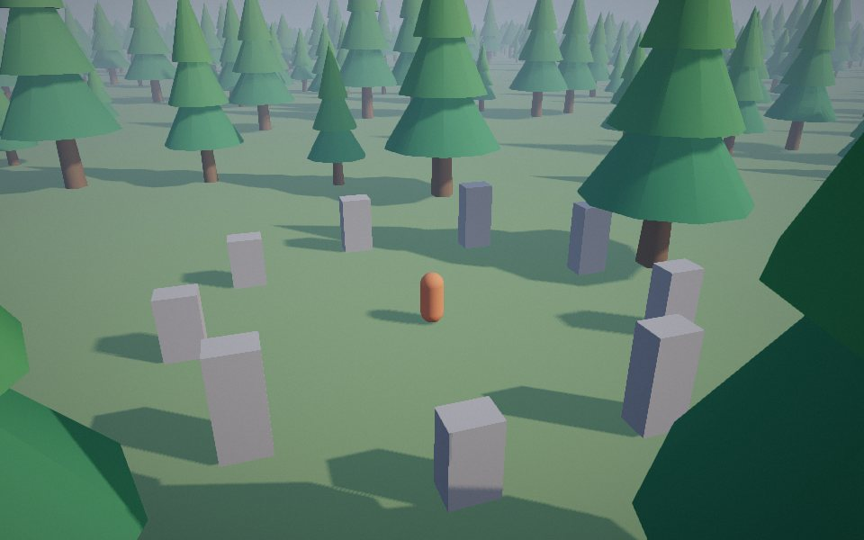
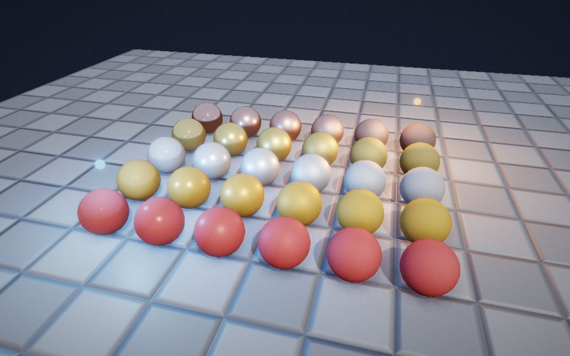
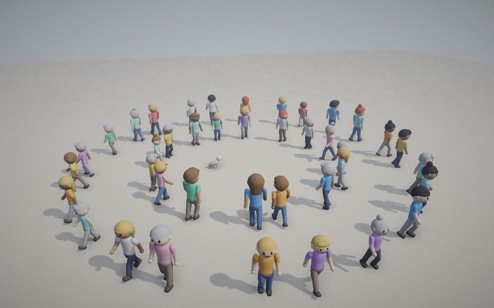
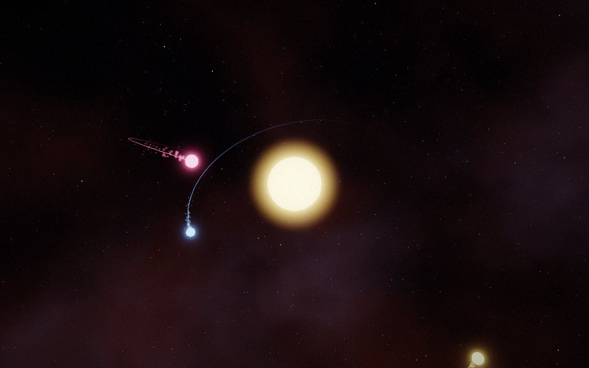
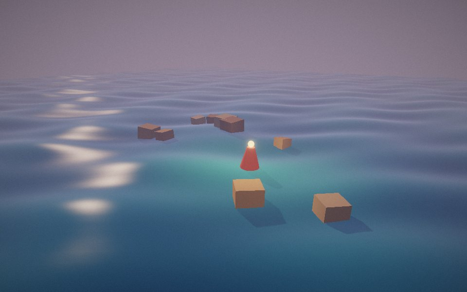
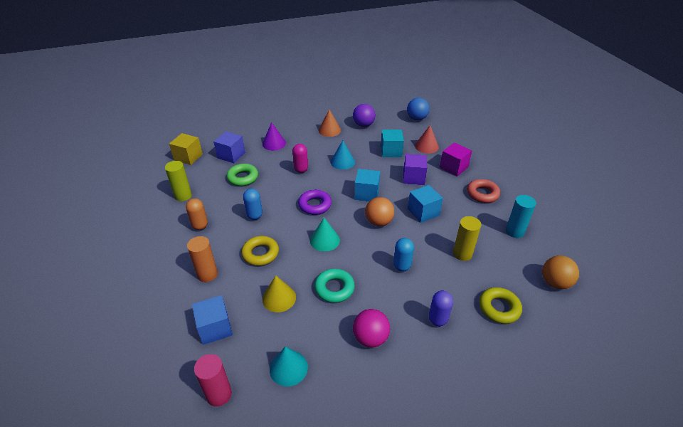
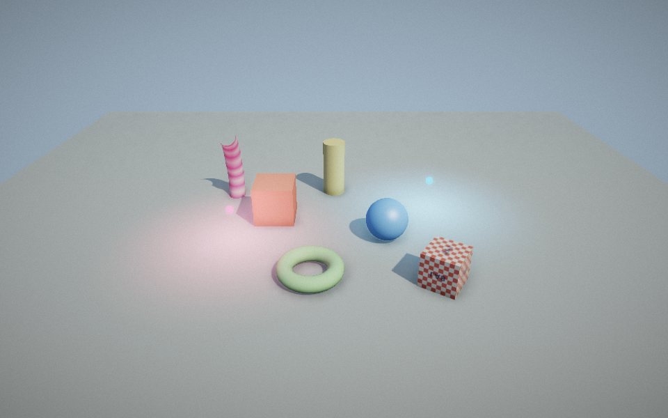
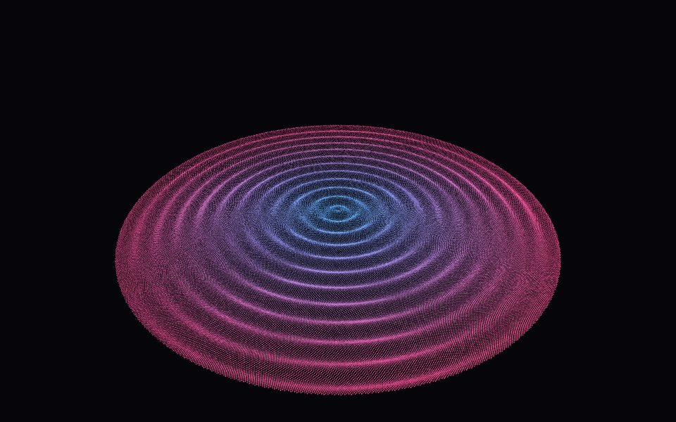
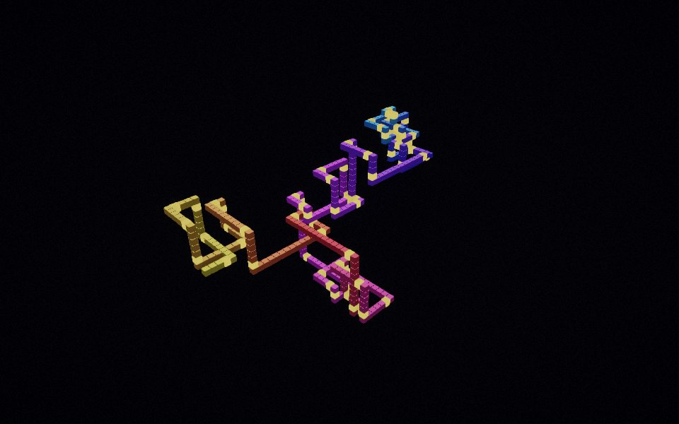

<div align="center">

# PROJECTION LAB

### A WebGL game engine built from the projection up

**[Live site](https://rohitpatil9121.github.io/projection_library/)** · **[Examples](https://rohitpatil9121.github.io/projection_library/examples/)** · **[Docs](https://rohitpatil9121.github.io/projection_library/docs/)** · **[Run the tests](https://rohitpatil9121.github.io/projection_library/tests/)**

`JavaScript` · `WebGL2` · `GLSL` · `ES modules` · `No three.js` · `No build step`



</div>

Projection Lab started as [projection_library](https://github.com/rohit-s-init/projection_library) by Rohit Sawant: a camera on a
sphere, a view basis built by hand, and a vertex shader that projects with three dot products instead of a view matrix.
That camera and projection still run every frame. Around them there is now an engine you can make a game with, and every
file in it opens with a plain-language account of what it does and why.

## What is in it

| | |
|---|---|
| **Rendering** | WebGL2 with a WebGL1 fallback, program variants from `#define`s, state caching, frustum culling, levels of detail, 100k+ instances in one draw call |
| **Light** | One sun with shadows (a fixed box, or up to three cascades that follow the camera), 16 point lights, hemisphere ambient, fog |
| **Materials** | Basic, Standard (textures, normal and emissive maps, vertex colours, palettes), PBR (metallic and roughness), custom GLSL with projection and lighting chunks |
| **Post effects** | HDR bloom, depth-aware ambient occlusion, ACES or Reinhard tone mapping, saturation, contrast, vignette, grain, edge anti-aliasing |
| **Models** | glTF 2.0 loader (.glb and .gltf): meshes, materials, textures, one skin, animations, morph targets, sparse accessors |
| **Animation** | Skeletons of up to 256 joints, clips with cross-fades, one small Animator per character over shared data |
| **Gameplay** | Fixed 60 Hz loop with interpolated rendering, input actions and axes (keyboard, mouse, gamepad, touch joystick), ray casts and overlap tests, tweens, camera shake, synthesised audio |
| **Effects** | Pooled particles, trails, glow shells, a procedural sky |
| **Tools** | Debug overlay, 57 browser tests, a headless test runner, an API reference generated from the source |

## Quick start

Copy `public/engine/`, `public/shaders/` and `public/vendor/` next to your page, then:

```js
import { Game, Entity, Mesh, PBRMaterial, StandardMaterial, ShadowMap, primitives } from "./engine/index.js";

const game = new Game({ canvas: document.querySelector("canvas") });
game.scene.shadow = new ShadowMap({ extent: [8, 8] });

const floor = new Mesh(primitives.plane(20, 20), new StandardMaterial({ color: [0.8, 0.8, 0.85] }));
const gold = new Mesh(primitives.sphere(1, 48, 32), new PBRMaterial({ color: [1, 0.77, 0.34], metallic: 1, roughness: 0.25 }));

game.add(new Entity({ mesh: floor }));
const ball = game.add(new Entity({ mesh: gold }));
ball.setPosition(0, 0, 1.5);

game.onUpdate(() => ball.setYaw(game.time));     // fixed 60 Hz steps, drawn at any refresh rate
game.start();
```

That is [`public/examples/first-scene.html`](public/examples/first-scene.html). The [getting started guide](https://rohitpatil9121.github.io/projection_library/docs/)
goes on from there.

Prefer one file? `npm run build` writes `public/dist/projection-lab.min.js` (about 165 KB, the same exports as
`engine/index.js`). The deploy workflow builds it too, so after a deploy it is served from the site at `dist/projection-lab.min.js`.

## Examples

| | | |
|---|---|---|
| [<br>**Open world**](https://rohitpatil9121.github.io/projection_library/examples/open-world.html)<br>cascaded shadows, culling, LOD, collision | [<br>**Materials**](https://rohitpatil9121.github.io/projection_library/examples/materials.html)<br>PBR, normal maps | [<br>**Characters**](https://rohitpatil9121.github.io/projection_library/examples/characters.html)<br>glTF, skinning, palettes |
| [<br>**Particles and bloom**](https://rohitpatil9121.github.io/projection_library/examples/particles.html) | [<br>**Custom shader**](https://rohitpatil9121.github.io/projection_library/examples/water.html) | [<br>**Picking**](https://rohitpatil9121.github.io/projection_library/examples/picking.html) |
| [<br>**Lit scene**](https://rohitpatil9121.github.io/projection_library/examples/lit-scene.html) | [<br>**Instancing benchmark**](https://rohitpatil9121.github.io/projection_library/experiments/instancing/) | [<br>**Prime Walk 3D**](https://rohitpatil9121.github.io/projection_library/prime-walk.html) |

## Games built with it

| Game | What it is |
|---|---|
| [Night Market](https://rohitpatil9121.github.io/night-market/) ([source](https://github.com/rohitpatil9121/night-market)) | A street-food tycoon where the staff and the regulars are the game |
| [Orbital](https://rohitpatil9121.github.io/orbital/) | A gravity puzzle. Place worlds, bend the path, reach the light |
| [Rewind Heist](https://rohitpatil9121.github.io/rewind-heist/) | A time-loop stealth heist. Every loop is replayed by a ghost of your past self |
| [Neon Rush](https://rohitpatil9121.github.io/neon-rush/) ([source](https://github.com/rohitpatil9121/neon-rush)) | A synthwave runner with five levels, power-ups and custom shaders |

## How the projection works

1. **Camera.** The eye sits on a sphere of radius `distance` around a `target`, steered by `yaw` and `pitch`. The world is Z-up.
2. **View basis.** `forward` is the view direction. `up` is world-up with its forward part removed. `right` is their cross product.
3. **Projection.** The vertex shader measures each vertex along those three axes and lets the GPU divide by depth:

```
v      = p - eye
clip.x = dot(v, right)   * focal / aspect
clip.y = dot(v, up)      * focal
clip.w = dot(v, forward)
```

`public/engine/Camera.js` documents the construction in full, and a test checks it against the original `Space.js` to the last bit.
The original renderer is still here (`public/Space.js`), and so are its demos: [Prime Walk on the first renderer](https://rohitpatil9121.github.io/projection_library/prime-walk-classic.html)
and the [OBJ viewer](https://rohitpatil9121.github.io/projection_library/preview.html).

## Working on the engine

```bash
git clone https://github.com/rohitpatil9121/projection_library.git
cd projection_library
npm install          # only needed for the bundle (esbuild); the engine and the tools have no other dependencies
npm start            # http://localhost:9600
```

| Command | What it does |
|---|---|
| `npm start` | Serves `public/` with a dependency-free static server |
| `npm test` | Runs the 57 browser tests in headless Chrome (set `CHROME_PATH` if Chrome is not in a usual place) |
| `npm run build` | Bundles the engine into `public/dist/projection-lab.min.js` and checks its exports |
| `npm run docs` | Regenerates `public/docs/api.html` from the comments in the source |
| `npm run shots` | Recaptures the thumbnails in `public/assets/shots/` |

Pushing to `main` runs the tests and, if they pass, deploys `public/` to GitHub Pages (`.github/workflows/pages.yml`).

```
public/
  engine/        the engine: one entry point, engine/index.js
  shaders/       GLSL as JavaScript modules, including the projection and lighting chunks
  examples/      one HTML file per example
  docs/          getting started guide and the generated API reference
  tests/         the test suite; open tests/ in a browser to run it
  site/          styles and scripts of the landing page
  Space.js       the original renderer, kept as a compatibility layer
tools/           static server, headless test runner, bundler, docs and thumbnail generators
ARCHITECTURE.md  design notes, decisions and measurements, phase by phase
THIRD_PARTY.md   everything that was not written here, with licences
```

## Credits

Originally developed by [Rohit Sawant](https://github.com/rohit-s-init) ([original repository](https://github.com/rohit-s-init/projection_library)).
Third-party code, fonts and the published techniques that were reimplemented are listed in [THIRD_PARTY.md](THIRD_PARTY.md).
